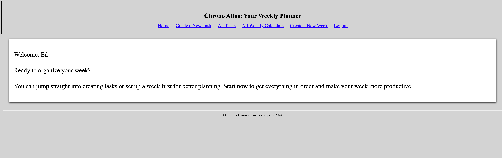

# Chrono Atlas Weekly Planner 

# Project name: Chrono Atlas Weekly Planner

## What is this?
This is a weekly planner that has 3 different categories:

1. ***2nd Brain category***:\
Use this section to jot down all your ideas and thoughts. It’s a place to offload your mental clutter so you don’t have to keep track of everything yourself.

2. ***Weekly Tasks category***:\
This area is for organizing and prioritizing tasks you need to tackle during the week. It’s perfect for keeping track of both urgent and important items, like setting up meetings for HR or gathering feedback.

3. ***Assigned Tasks category***:\
Here, you can keep track of tasks that have been assigned and scheduled in your weekly planner. This helps you stay organized and ensures you meet your deadlines.

## How to use it?
You can either set up your week first to assign tasks to specific days or start by creating tasks directly in the 2nd Brain or Weekly Tasks categories. 

## Why I chose this as my project?

I’m currently using a version inspired by ***Stephen Covey’s The 7 Habits of Highly Effective People***. While the visual approach is effective, involving writing down tasks on a static image, I’m transitioning to a more flexible online version.

This new digital tool lets me type and organize tasks with much more flexibility. Unlike the old method where I had to draw everything on a static image, this online version allows me to prioritize tasks by day. It helps me stay on top of both my daily responsibilities and long-term goals. This change makes managing my tasks easier and fits better with my need for a more adaptable and accessible planning system.

## Getting started
[Deployed app link](https://cawp.onrender.com)\
[Planing app link(trello)](https://trello.com/b/QvKs4ejv/time-atlas)

## Attributions:
[date-fns library documentation](https://date-fns.org/)

## Technology Used:
**JavaScript**\
**CSS**\
**bcrypt**\
**connect-mongo**\
**date-fns**\
**dotenev**\
**ejs**\
**express**\
**express-session**\
**method-override**\
**mongoose**\
**morgan**

## Next steps(stretch goals):
1. Enhance Background Themes: Introduce a variety of background themes, such as a sleek dark mode or a calming zen-inspired background video, to personalize and enrich the user experience.

2. User Permissions: Implement a robust permissions system allowing users to view, create, edit, and delete tasks based on their authorization levels, fostering better collaboration and task management.

3. Habit Tracker Functionality: Add a habit tracking feature that allows users to set tasks related to their habits, such as reading a book. This feature would automatically track and calculate progress over weeks or months, providing valuable insights into habit formation.

4. Calendar Integration: Integrate with Google Calendar or other popular calendar applications, enabling seamless synchronization of tasks and schedules for improved planning and organization.

5. Flexible Task Allocation: Allow users to create tasks and assign them to specific days before setting up a week. Currently, tasks must be assigned within the context of an existing week, which can be limiting. This enhancement will streamline the task management process and improve overall user experience.

## Web Accessibility

